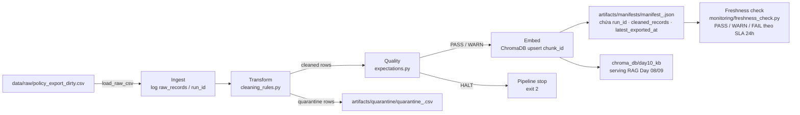

# Kiến trúc pipeline — Lab Day 10

**Nhóm:** Nhóm 12 — 402  
**Cập nhật:** 2026-04-15

---

## 1. Sơ đồ luồng



**ASCII tóm tắt:**
```
raw CSV
  │  run_id gắn ngay từ đầu
  ▼
Ingest (log raw_records)
  ├─► quarantine CSV  ←── doc_id lạ / ngày sai / HR cũ / duplicate
  ▼
Transform (cleaning_rules.py)
  ▼
Quality / Expectations (expectations.py)
  ├─► HALT → exit 2
  ▼
Embed → ChromaDB (upsert chunk_id, prune id cũ)
  ▼
Manifest JSON (run_id, cleaned_records, latest_exported_at)
  ▼
Freshness check (so sánh latest_exported_at vs now, SLA=24h)
```

---

## 2. Ranh giới trách nhiệm

| Thành phần | Input | Output | Owner nhóm |
|------------|-------|--------|--------------|
| Ingest | `data/raw/policy_export_dirty.csv` | List[dict] rows + log `raw_records` | Người 1 |
| Transform | List[dict] rows | `cleaned` rows + `quarantine` rows | Người 3 |
| Quality | `cleaned` rows | Pass/Warn/Halt + log expectation | Người 2 |
| Embed | `cleaned` CSV | ChromaDB collection `day10_kb` (upsert) | Người 1 |
| Monitor | `manifest_<run_id>.json` | PASS / WARN / FAIL + `age_hours` | Người 4 |

---

## 3. Idempotency & rerun

- **chunk_id** được tạo bằng SHA-256 của `doc_id | chunk_text | seq` → stable, không thay đổi khi rerun cùng data.
- Embed dùng **upsert** theo `chunk_id`: rerun 2 lần với cùng cleaned CSV → ChromaDB không tạo thêm vector trùng.
- Sau mỗi publish, pipeline **prune** các `chunk_id` trong collection không còn xuất hiện trong cleaned run hiện tại (`embed_prune_removed` ghi trong log) → index luôn là snapshot của lần chạy gần nhất, không tích luỹ chunk lạc hậu.
- Kiểm chứng: chạy `python etl_pipeline.py run` 2 lần liên tiếp với cùng raw CSV → `embed_upsert count` bằng nhau, `embed_prune_removed=0`.

---

## 4. Liên hệ Day 09

- Cùng corpus tài liệu `data/docs/` (5 file policy/FAQ/SLA/HR) được dùng ở Day 08/09.
- Pipeline Day 10 **thay thế bước embed thủ công** của Day 09 bằng luồng ingest → clean → validate → embed có kiểm soát version.
- ChromaDB collection `day10_kb` có thể được RAG agent Day 09 truy vấn trực tiếp sau khi pipeline chạy xong — đảm bảo agent luôn đọc đúng version chunk đã được validate (ví dụ: refund window 7 ngày, không phải bản stale 14 ngày).

---

## 5. Rủi ro đã biết

- **Freshness FAIL trên data mẫu:** `policy_export_dirty.csv` có `exported_at = 2026-04-10`, cách thời điểm chạy >24h → `freshness_check=FAIL` là hành vi đúng. Ghi trong runbook: SLA áp cho "thời điểm export từ hệ nguồn", không phải thời điểm chạy pipeline.
- **Model download lần đầu:** `all-MiniLM-L6-v2` (~90MB) cần kết nối mạng lần đầu; các lần sau cache local.
- **HR version conflict:** `hr_leave_policy` có 2 bản (10 ngày vs 12 ngày phép) — bản có `effective_date < 2026-01-01` bị quarantine; nếu cả 2 bản đều sau 2026-01-01 sẽ cần rule bổ sung.
- **chunk_id thay đổi khi sửa text:** nếu cleaning rule thay đổi nội dung `chunk_text`, `chunk_id` mới được tạo → chunk cũ được prune, chunk mới upsert. Đây là hành vi đúng nhưng cần lưu ý khi so sánh eval before/after.
